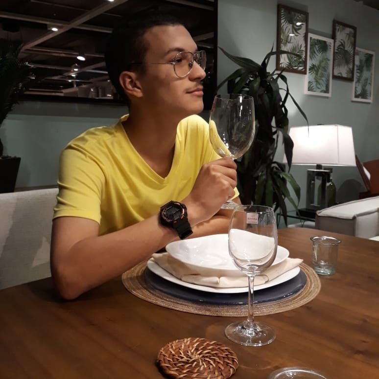
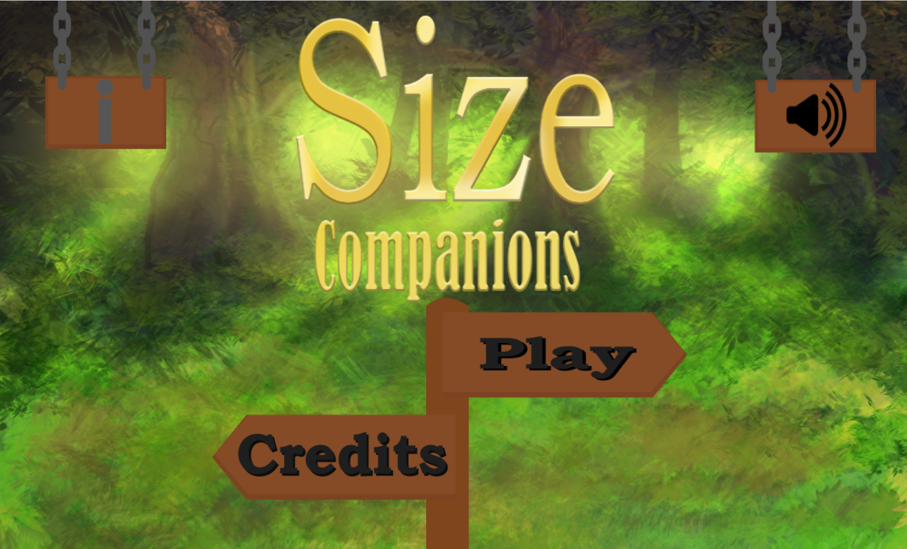
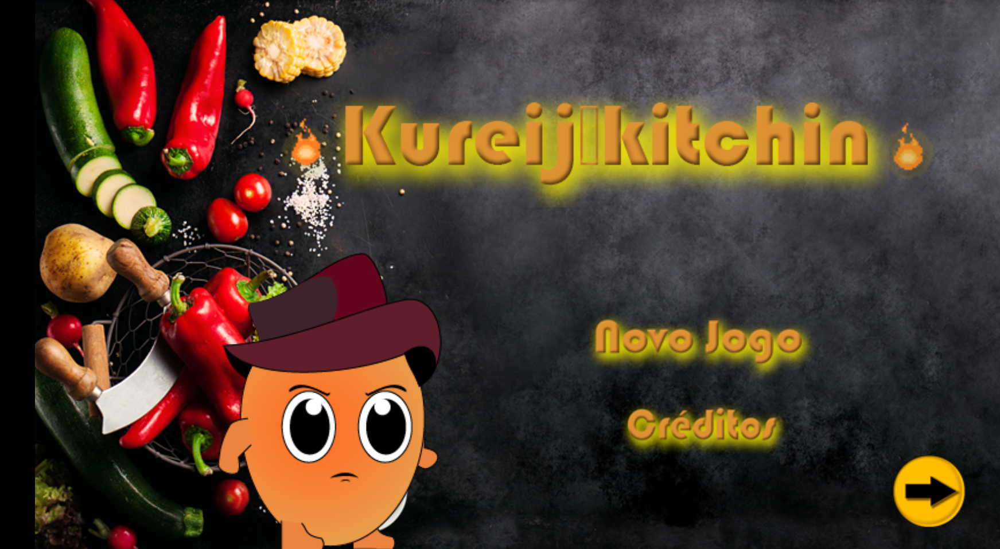

## Meu Portfólio

Wanderson Nunes, 18 anos

Estudante do IFRN que cursa Jogos Digitais

Roteirista, criador de personagens e narrativas. Futuro Game Design. Mestre de RPG de mesa.

## Contatos 
1: Pinterest:

<a href="https://br.pinterest.com/wandersonngg/"target="_blank">Wanderson Nunes </a>

2: Facebook:

(https://www.facebook.com/wanderson.nunesgomes)

3: Discord:

4: E-mail:

[Outlook:] [wandersonngg@hotmail.com]

[Gmail:] [blackscarlate@gmail.com]

## Projetos

## Jogos

**Midnight Despair**

**Size Companions**:

**Cozinha Maluca**:

